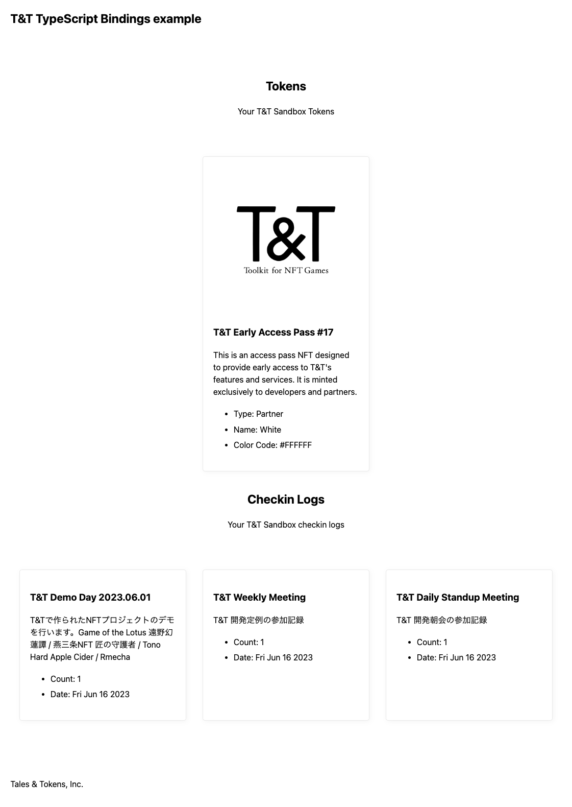

# Tales & Tokens example web app

## Features

- View a list of NFTs
- View a list of check-in records

Transaction sending will be implemented soon.

## Execution Networks

- Polygon Testnet(Mumbai)

Mainnet support will be implemented soon. 

## Setup

- Clone this repository.
- `npm install`
- create `.env.local`
  - show `.env.local.example`

## Developing

```
npm run dev

# or start the server and open the app in a new browser tab
npm run dev -- --open
```

## Screen Shot


